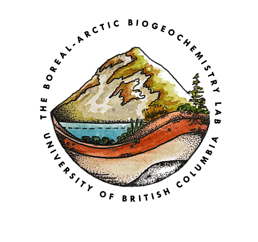

<!-- Improved compatibility of back to top link: See: https://github.com/othneildrew/Best-README-Template/pull/73 -->

<!--
*** Thanks for checking out the Best-README-Template. If you have a suggestion
*** that would make this better, please fork the repo and create a pull request
*** or simply open an issue with the tag "enhancement".
*** Don't forget to give the project a star!
*** Thanks again! Now go create something AMAZING! :D
-->

<!-- PROJECT SHIELDS -->
<!--
*** I'm using markdown "reference style" links for readability.
*** Reference links are enclosed in brackets [ ] instead of parentheses ( ).
*** See the bottom of this document for the declaration of the reference variables
*** for contributors-url, forks-url, etc. This is an optional, concise syntax you may use.
*** https://www.markdownguide.org/basic-syntax/#reference-style-links
-->
[![Contributors][contributors-shield]][contributors-url]
[![Forks][forks-shield]][forks-url]
[![Stargazers][stars-shield]][stars-url]
[![Issues][issues-shield]][issues-url]
[![project_license][license-shield]][license-url]
[![LinkedIn][linkedin-shield]][linkedin-url]

<!-- PROJECT LOGO -->
 

  

<h3 align="center">The Boreal Arctic Biogeochemistry Lab Website</h3>

  

    Welcome to the University of British Columbia's Boreal Arctic Biogeochemistry Lab, or as we like to call it BAB Lab's, Github Website! Thank you for taking a gander over here, and feel free to learn a bit more about our lab through this README, or even better go ahead and visit the <a href="https://bab-lab.github.io"><strong>website</strong></a> itself!
     
    <a href="https://github.com/bab-lab/bab-lab.github.io"><strong>Explore the Website's Backend »</strong></a>
     
     
  

<!-- ABOUT THE PROJECT -->
## About Our Lab Group

The BAB Lab is located in the University of British Columbia’s Geography Department, which we respectfully acknowledge exist on the traditional, ancestral, and unceded territories of the hən̓q̓əmin̓əm̓-speaking xʷməθkʷəy̓əm (Musqueam) people, the Halq'eméylem speaking Coast Salish people, including the Sto:lo and the Seabird Island First Nations.

We are broadly interested in better understanding the impacts of climate warming and human disturbances on carbon and nutrient cycling in boreal-Arctic terrestrial and aquatic ecosystems. Our research group draws on principles and approaches from physical geography including environmental chemistry, earth sciences, geographical sciences, hydrology, limnology, microbiology, and ecology.

(<a href="#readme-top">back to top</a>)

<!-- CONTRIBUTING -->
## Contributing

Contributions are what make the open source community such an amazing place to learn, inspire, and create. Any contributions you make are **greatly appreciated**.

If you have a suggestion that would make this better, please fork the repo and create a pull request.
Don't forget to give the project a star! Thanks again!

1. Fork the Project
2. Create your Feature Branch (`git checkout -b feature/AmazingFeature`)
3. Commit your Changes (`git commit -m 'Add some AmazingFeature'`)
4. Push to the Branch (`git push origin feature/AmazingFeature`)
5. Open a Pull Request

(<a href="#readme-top">back to top</a>)

### Top contributors:

<!-- CONTACT -->
## Contact

Dr. McKenzie Kuhn - [Assisstant Professor (UBC)](https://geog.ubc.ca/profile/mckenzie-kuhn/) - mckenzie.kuhn@ubc.ca

Project Link: [https://github.com/bab-lab/bab-lab.github.io](https://github.com/bab-lab/bab-lab.github.io)

(<a href="#readme-top">back to top</a>)

<!-- ACKNOWLEDGMENTS -->
## Acknowledgments

* [Kelsey McGuire - MSc Student](https://geog.ubc.ca/profile/kelsey-mcguire/)
* [Lyreshka Castro Morales - MSc Student](https://bab-lab.github.io/people/)
* [Himari Honda - MSc Student]()

(<a href="#readme-top">back to top</a>)

<!-- MARKDOWN LINKS & IMAGES -->
<!-- https://www.markdownguide.org/basic-syntax/#reference-style-links -->
[contributors-shield]: https://img.shields.io/github/contributors/bab-lab/bab-lab.github.io.svg?style=for-the-badge
[contributors-url]: https://github.com/bab-lab/bab-lab.github.io/graphs/contributors
[forks-shield]: https://img.shields.io/github/forks/bab-lab/bab-lab.github.io.svg?style=for-the-badge
[forks-url]: https://github.com/bab-lab/bab-lab.github.io/network/members
[stars-shield]: https://img.shields.io/github/stars/bab-lab/bab-lab.github.io.svg?style=for-the-badge
[stars-url]: https://github.com/bab-lab/bab-lab.github.io/stargazers
[issues-shield]: https://img.shields.io/github/issues/bab-lab/bab-lab.github.io.svg?style=for-the-badge
[issues-url]: https://github.com/bab-lab/bab-lab.github.io/issues
[license-shield]: https://img.shields.io/github/license/bab-lab/bab-lab.github.io.svg?style=for-the-badge
[license-url]: https://github.com/bab-lab/bab-lab.github.io/blob/master/LICENSE.txt
[linkedin-shield]: https://img.shields.io/badge/-LinkedIn-black.svg?style=for-the-badge&logo=linkedin&colorB=555
[linkedin-url]: https://linkedin.com/in/linkedin_username
[product-screenshot]: images/screenshot.png
[Next.js]: https://img.shields.io/badge/next.js-000000?style=for-the-badge&logo=nextdotjs&logoColor=white
[Next-url]: https://nextjs.org/
[React.js]: https://img.shields.io/badge/React-20232A?style=for-the-badge&logo=react&logoColor=61DAFB
[React-url]: https://reactjs.org/
[Vue.js]: https://img.shields.io/badge/Vue.js-35495E?style=for-the-badge&logo=vuedotjs&logoColor=4FC08D
[Vue-url]: https://vuejs.org/
[Angular.io]: https://img.shields.io/badge/Angular-DD0031?style=for-the-badge&logo=angular&logoColor=white
[Angular-url]: https://angular.io/
[Svelte.dev]: https://img.shields.io/badge/Svelte-4A4A55?style=for-the-badge&logo=svelte&logoColor=FF3E00
[Svelte-url]: https://svelte.dev/
[Laravel.com]: https://img.shields.io/badge/Laravel-FF2D20?style=for-the-badge&logo=laravel&logoColor=white
[Laravel-url]: https://laravel.com
[Bootstrap.com]: https://img.shields.io/badge/Bootstrap-563D7C?style=for-the-badge&logo=bootstrap&logoColor=white
[Bootstrap-url]: https://getbootstrap.com
[JQuery.com]: https://img.shields.io/badge/jQuery-0769AD?style=for-the-badge&logo=jquery&logoColor=white
[JQuery-url]: https://jquery.com 
